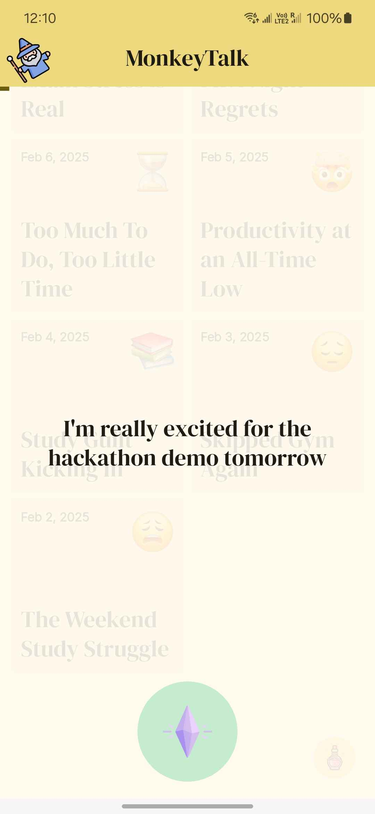

# MonkeyTalk

MonkeyTalk is designed to make **daily journaling** easy, fun, and private. instead of manually
typing, users can record short audio logs throughout the day. the app automatically transcribes
these logs and combines them into a single daily journal entry. using **local ai**
via [ollama](https://github.com/jmorganca/ollama) and a **retrieval-augmented generation (rag)**
model, MonkeyTalk can detect certain activities—like skipping workouts or feeling stressed—and
suggest ways to get back on track.

---

## Key Objectives

- provide timely nudges for healthier habits.
- maintain data privacy by running ai inference locally.

---

## Screenshots

| Main Journal Screen                              | Reminders                                          | Audio Transcription                            |
|--------------------------------------------------|----------------------------------------------------|------------------------------------------------|
|  |  |  |

---

## Installation

Follow these steps to run the app locally on your machine:

1. **Clone the Repository**
   ```bash
   git clone https://github.com/your-username/monkeytalk.git
   cd monkeytalk

## Credits

- Fantasy themed icons from https://www.flaticon.com